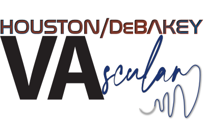

 

## 1. [Inadvertent employee /trainee needlestick](https://nealbarshes-protocols.github.io/ContingencyPlans/Needlestick/)

## 2. [Intraoperative contamination](https://nealbarshes-protocols.github.io/ContingencyPlans/Contamination/)

## 3. [Weather-related impacts on clinical care](https://nealbarshes-protocols.github.io/ContingencyPlans/WeatherEvents/)

## 4. [Transitioning clinical duties when fatigue or work hours are an issue](https://nealbarshes-protocols.github.io/ContingencyPlans/Fatigue.md)

